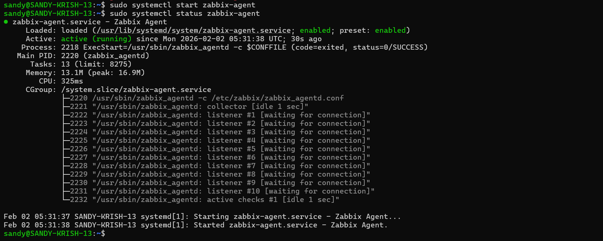
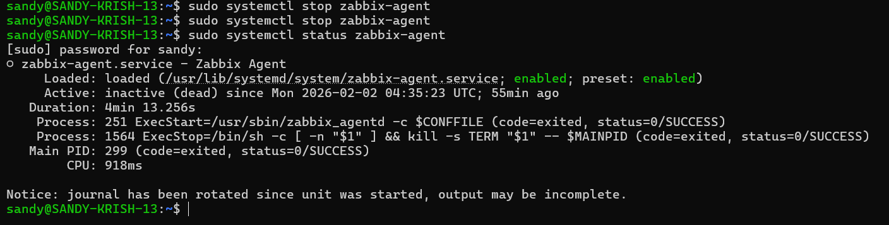
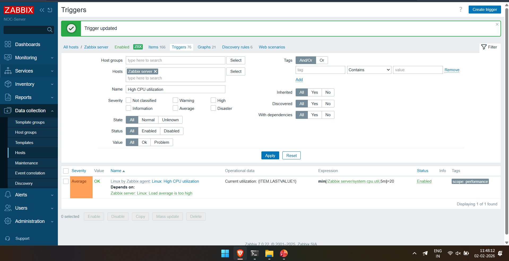

## Zabbix NOC Monitoring & Incident Detection Lab
This project is a hands-on Network Operations Center (NOC) monitoring lab built using Zabbix.
It simulates real-world infrastructure monitoring scenarios such as service failures, alert generation, performance degradation, and incident validation.
The goal of this lab is to understand how enterprise monitoring systems work in practice — not just how to install them, but how they detect issues, raise alerts, and help operators analyze problems.

## Objective
To gain practical, job-ready experience in:
Infrastructure and host monitorin
Agent-based data collectio
Alerting and trigger configuration
Incident detection and validation
System performance and network monitoring
NOC-style dashboards and visual maps

## Lab Architecture
Components
Zabbix Server running on Linux
Zabbix Agent installed on the monitored host
Zabbix Web Frontend for monitoring and visualization
systemd-managed services

## Monitoring Flow
Zabbix Agent → Zabbix Server → Triggers → Alerts → Dashboards

## Tools & Technologies
Zabbix Server & Zabbix Agent
Linux (Ubuntu)
systemd
SSH
Virtual Machine (Local / AWS)
Basic networking concepts (IP, ports, services)

## Setup Summary
Installed and configured Zabbix Server on Linux
Installed Zabbix Agent on the monitored host
Verified agent–server communication
Applied default OS and performance templates
Enabled monitoring for CPU, memory, disk, and network interfaces
Configured custom triggers and alert logic

## Service Failure Detection (Incident Simulation)
To simulate a real NOC incident:
The Zabbix Agent service was manually stopped using systemctl
The Zabbix Server detected the agent as unavailable
An alert was triggered: “Linux: Zabbix agent is not available”
The incident appeared in the Problems dashboard
This demonstrates real-time availability monitoring and alert generation, similar to real production environments.

## Root Cause Analysis
The monitoring system correctly distinguished between:
Zabbix Agent service failure
Zabbix Server restart (uptime less than 10 minutes)
This confirms proper cause vs symptom identification, which is a core skill for NOC and SOC analysts.

## Performance Monitoring & Triggers
CPU utilization triggers were configured using expressions
Severity levels such as Warning and Average were applied
Trigger dependencies were used to reduce alert noise
Real CPU stress was generated to validate trigger behavior
All alerts were verified against actual system load, not assumptions.

## Stress Testing & Validation
CPU load was intentionally increased
Real-time graphs showed clear usage spikes
Trigger states changed correctly during high utilization
System recovery was observed after load reduction
This confirmed that the alerts were accurate, reliable, and meaningful.

## Network Flow Monitoring
Monitored the primary network interface (eth0)
Tracked inbound and outbound traffic
Observed packet statistics and traffic trends
This is useful for identifying abnormal network behavior or congestion.

## Visual Command Center
Global dashboard for quick infrastructure overview
Panels showing host availability and problem severity
Network maps for visual monitoring
The setup is designed to resemble enterprise NOC wallboards used by operations teams.

## Key Learnings
How NOC teams monitor infrastructure health in real environments
The importance of proactive alerting
Differences between agent-level and service-level failures
Trigger logic and alert lifecycle management
Linux service troubleshooting
Performance and network visibility using monitoring tools

##  Screenshots

### System Deployment

### Service Failure Detection

### Root Cause Analysis

### CPU Trigger Configuration

### Stress Testing & Performance Graph

### Network Flow Monitoring

### NOC Dashboard View

